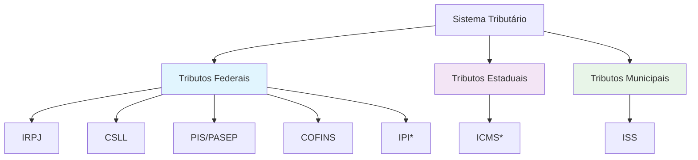

# 🧮 Guia Tributário para Empresas de Tecnologia

> Um overview elegante do sistema tributário brasileiro aplicado a empresas de tech

## 🏛️ Estrutura Tributária

## 📊 Tributos Principais

### 🎯 Tributos Federais

| Tributo | Sigla | Alíquota | Aplicação |
|---------|-------|----------|-----------|
| **Imposto de Renda** | IRPJ | 15% + 10% | Lucro da empresa |
| **Contribuição Social** | CSLL | 9% | Lucro líquido |
| **Programa de Integração** | PIS | 0,65% - 1,65% | Folha/Faturamento |
| **Seguridade Social** | COFINS | 3% - 7,6% | Faturamento |
| **Produtos Industrializados** | IPI | Variável | Indústria |

### Federais

| Tributo | Descrição | Alíquota Base |
|---------|-----------|---------------|
| **IRPJ** | Imposto de Renda Pessoa Jurídica | 15% + 10% adicional |
| **CSLL** | Contribuição Social sobre Lucro Líquido | 9% |
| **PIS** | Programa de Integração Social | 0,65% - 1,65% |
| **COFINS** | Contribuição para o Financiamento da Seguridade Social | 3% - 7,6% |

### 🗺️ Estaduais

| Tributo | Descrição | Alíquota Base |
|---------|-----------|---------------|
| **ICMS** | Imposto sobre Circulação de Mercadorias | 17% - 18% |

### 🏙️ Municipais

| Tributo | Descrição | Alíquota Base |
|---------|-----------|---------------|
| **ISS** | Imposto sobre Serviços | 2% - 5% |
